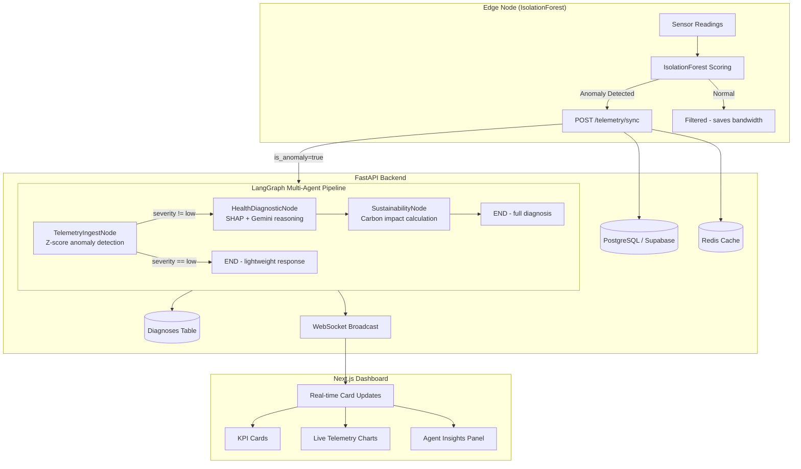

# SustainTwin AI

[](https://github.com/AadiHaldar/SustainTwin_AI-fleet-Command/actions/workflows/ci.yml)

**Agentic Edge Intelligence for Sustainable Heavy Machinery Fleets**

SustainTwin AI is a full-stack platform that enables autonomous fleet orchestration for industrial heavy machinery. By combining **multi-agent LangGraph reasoning, on-device IsolationForest inference, SHAP-guided Gemini XAI, and real-time WebSocket telemetry**, the platform transforms raw sensor data into actionable, explainable insights.

---

## Architecture



---

## Key Features

| Feature | Implementation |
|---|---|
| **Multi-Agent Reasoning** | 3-node LangGraph graph with conditional routing. Only calls Gemini for medium/critical anomalies. |
| **Explainable AI** | SHAP feature importances are injected into the Gemini prompt, guiding the LLM's root-cause analysis. |
| **Edge Intelligence** | `sklearn.IsolationForest` runs on-device, filtering ~85-95% of normal readings before cloud sync. |
| **Real-Time Dashboard** | WebSocket connection pushes telemetry and diagnoses to the frontend instantly. |
| **RBAC Security** | JWT auth with 3 roles (operator/engineer/admin). Routes enforce role-based access. |
| **Sustainability** | Carbon impact calculated using EPA emission factors. Actionable recommendations per anomaly. |

---

## Tech Stack

### Frontend
- **Next.js 16** (App Router), React 19, TypeScript
- **Tailwind CSS v4**, ShadCN UI (dark glassmorphism)
- **Recharts** (area/bar/pie charts), **Framer Motion** (animations)
- **WebSocket** (native API with auto-reconnect)

### Backend
- **FastAPI** (Python 3.11+)
- **PostgreSQL** via Supabase (production) or Docker (local dev)
- **Redis** for telemetry caching (optional, graceful fallback)
- **LangGraph** + **Google Gemini 2.5 Flash** (multi-agent reasoning)
- **SHAP** + **scikit-learn** (explainability + anomaly detection)
- **SQLAlchemy** ORM, **JWT** auth (python-jose + bcrypt)

### Edge
- **scikit-learn IsolationForest** (on-device ML inference)
- Configurable anomaly threshold with compression ratio logging

---

## Local Setup

### Prerequisites
- Node.js 18+, Python 3.11+, Git
- Docker (optional, for local Postgres + Redis)

### 1. Clone & Configure
```bash
git clone https://github.com/AadiHaldar/SustainTwin_AI-fleet-Command.git
cd SustainTwin_AI-fleet-Command
cp .env.example backend/.env
# Edit backend/.env with your Supabase URL and Gemini API key
```

### 2. Backend
```bash
cd backend
python -m venv venv
venv\Scripts\activate       # Windows
# source venv/bin/activate  # Mac/Linux

pip install -r requirements.txt
python app/core/ingest_data.py   # Seed DB + train anomaly model
uvicorn app.main:app --reload --port 8000
```

### 3. Frontend
```bash
cd frontend
npm install
npm run dev
```

### 4. Edge Simulator (Optional)
```bash
cd edge
pip install -r requirements.txt
python main.py --machine-id M-999
```

### 5. Docker (Alternative)
```bash
docker-compose up -d   # Starts Postgres + Redis + Backend
```

---

## API Endpoints

| Method | Path | Auth | Role |
|--------|------|------|------|
| POST | `/api/v1/auth/token` | - | Login |
| GET | `/api/v1/telemetry` | JWT | operator, engineer, admin |
| GET | `/api/v1/telemetry/{id}` | JWT | operator, engineer, admin |
| POST | `/api/v1/telemetry/sync` | JWT | engineer, admin |
| GET | `/api/v1/diagnostics` | JWT | engineer, admin |
| GET | `/api/v1/diagnostics/{id}` | JWT | engineer, admin |
| WS | `/ws/telemetry` | - | Real-time broadcast |

**Test credentials:** `operator/operator123`, `engineer/engineer123`, `admin/admin123`

---

## Running Tests

```bash
cd backend
pytest tests/ -v
```

Tests cover:
- Agent nodes (z-score detection, carbon calculation, conditional routing)
- API endpoints (auth flow, RBAC enforcement)
- Edge node (IsolationForest scoring, compression ratio)

---

## Datasets

- **AI4I 2020 Predictive Maintenance** (HuggingFace): 19,535 rows of milling machine telemetry used to seed the database
- **Microsoft Azure Predictive Maintenance** (Kaggle): 876,100 rows validated via `explore_kaggle.py` to prove schema generalization

---

## Project Structure

```
SustainTwin/
├── backend/
│   ├── app/
│   │   ├── agents/          # LangGraph multi-agent pipeline
│   │   │   ├── graph.py     # StateGraph with conditional routing
│   │   │   ├── telemetry_ingest_node.py
│   │   │   ├── health_diagnostic_node.py
│   │   │   ├── sustainability_node.py
│   │   │   ├── shap_explainer.py
│   │   │   └── health_agent.py
│   │   ├── api/             # FastAPI routers
│   │   │   ├── auth.py      # JWT login
│   │   │   ├── telemetry.py # CRUD + agent trigger
│   │   │   ├── diagnostics.py
│   │   │   └── websocket.py # Real-time broadcast
│   │   ├── core/            # Config, DB, Redis, Security
│   │   └── models/          # SQLAlchemy models
│   ├── tests/               # pytest test suite
│   ├── Dockerfile
│   └── requirements.txt
├── edge/                    # Smart edge node (IsolationForest)
├── frontend/                # Next.js 16 dashboard
│   └── src/
│       ├── app/             # Pages (fleet, health, sustainability, xai)
│       ├── components/      # UI components (ShadCN + sidebar)
│       └── hooks/           # useWebSocket, useApi
├── docker-compose.yml       # Postgres + Redis + Backend
├── .github/workflows/ci.yml # GitHub Actions CI
└── README.md
```

---

## License

This project was built for the Tata Hackathon. All rights reserved by the creators.
